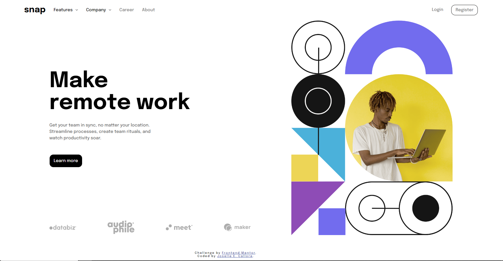

# Frontend Mentor - Intro section with dropdown navigation solution

This is a solution to the [Intro section with dropdown navigation challenge on Frontend Mentor](https://www.frontendmentor.io/challenges/intro-section-with-dropdown-navigation-ryaPetHE5). Frontend Mentor challenges help you improve your coding skills by building realistic projects. 

## Table of contents

- [Overview](#overview)
  - [The challenge](#the-challenge)
  - [Screenshot](#screenshot)
  - [Links](#links)
- [My process](#my-process)
  - [Built with](#built-with)
  - [What I learned](#what-i-learned)
  - [Continued development](#continued-development)
  - [Useful resources](#useful-resources)
- [Author](#author)
- [Acknowledgments](#acknowledgments)

**Note: Delete this note and update the table of contents based on what sections you keep.**

## Overview

### The challenge

Users should be able to:

- View the relevant dropdown menus on desktop and mobile when interacting with the navigation links
- View the optimal layout for the content depending on their device's screen size
- See hover states for all interactive elements on the page

### Screenshot


### Links

- Solution URL: [https://github.com/josellecallora08/Snap-Frontend](https://your-solution-url.com)
- Live Site URL: [https://josellecallora08.github.io/Snap-Frontend/](https://your-live-site-url.com)

## My process
Since I have been practicing Frontend Development, I started Mobile Design first then proceeding to Desktop Design.
### Built with

- Semantic HTML5 markup
- CSS custom properties
- Flexbox
- CSS Grid
- Mobile-first workflow

### What I learned

Use this section to recap over some of your major learnings while working through this project. Writing these out and providing code samples of areas you want to highlight is a great way to reinforce your own knowledge.

To see how you can add code snippets, see below:

```html
<h1>Some HTML code I'm proud of</h1>
  <li>
          <button class="features" onclick="showFeatures()">
            <span>Features</span>
            
          </button>
          <div class="features-nav">
            <ul>
              <li>
                <a href="">
                  
                  <span>Todo List</span>
                </a>
              </li>
              <li>
                <a href="">
                  
                  <span>Calendar</span>
                </a>
              </li>
              <li>
                <a href="">
                  
                  <span>Reminders</span>
                </a>
              </li>
              <li>
                <a href="">
                  
                  <span>Planning</span>
                </a>
              </li>
            </ul>
          </div>
        </li>
```css
.features-nav, .company-nav{
    width: 90%;
    height: 0;
    transform: translateY(-100%);
    transition: 300ms ease-in-out;
    z-index: -1;
    & ul{
        width: 100%;
        margin: 0;
        margin-left: 10px;
        padding: 0;
        z-index: -1;
    }

    & li a{
        display: flex;
        align-items: center;
        gap: 15px;
    }

    & li a img{
        width: 15px;
    }

    &.active{
        height: 100%;
        transform: translateY(0);
        transition: 300ms ease-in-out;
    }
}
```
```js
function showFeatures(){
    features_innernav.classList.toggle('active')
    features_span.classList.toggle('active')
    features_icon.classList.toggle('active')
    if(features_icon.classList.contains('active')){
        features_icon.src = `./images/icon-arrow-up.svg`
    } else{
        features_icon.src = `./images/icon-arrow-down.svg`
    }
}
```

If you want more help with writing markdown, we'd recommend checking out [The Markdown Guide](https://www.markdownguide.org/) to learn more.


## Author

- Frontend Mentor - [@josellecallora08](https://www.frontendmentor.io/profile/yourusername)
- Twitter - [@josellecallora08](https://www.twitter.com/yourusername)
- Facebook - [@josellecallora08](https://www.facebook.com/yourusername)

